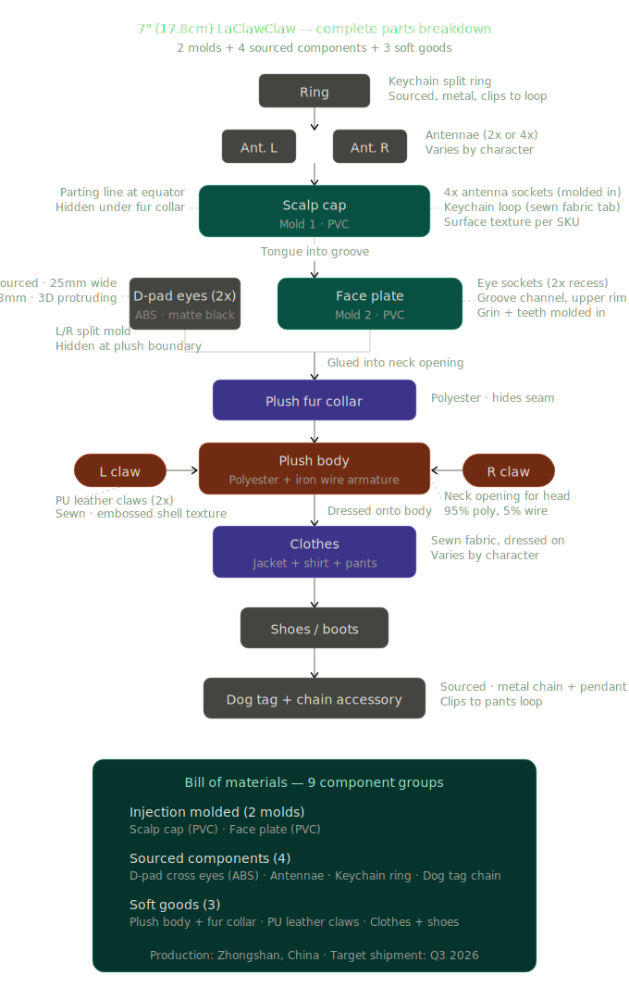

# Glytch: Nemo Edition

7" (17.8 cm) designer collectible figure — first drop in the LaClawClaw
universe. Founders Edition pre-order at [laclawclaw.com](https://laclawclaw.com).

**Status:** CAD handoff. First-shot sample (T1) expected after CAD sign-off.
**Ship target:** Q3 2026.
**Factory:** Zhongshan, China.
**Edition size:** 200.

## Design intent

GPU-punk. Corporate insurgent with a permanent grin. Circuit-board cranium
with PCB trace engravings. Cross-shaped D-pad eyes. Signature leather
jacket. Dog tags stamped with model weights. Reactor-green fur collar.

## What's in this folder

- [`parts-breakdown.svg`](./parts-breakdown.svg) — exploded diagram of all 9
  component groups
- [`mold-specs.md`](./mold-specs.md) — dimensions, tolerances, surface
  finish, parting line strategy
- [`workflow.md`](./workflow.md) — 5 manufacturing phases from design
  handoff through mass production
- [`factory-questions.md`](./factory-questions.md) — open questions we're
  asking the factory, and their answers when received
- [`cad/`](./cad/) — reference 3D assets (STL + GLB). **GitHub renders STL
  files inline — click [`cad/glytch-nemo-edition.stl`](./cad/glytch-nemo-edition.stl)
  to spin the model right in your browser.**
- [`photos/`](./photos/) — reference photos of the current prototype

## Bill of materials — 9 component groups

### Injection molded (2 molds)

| Part | Material | Mold # |
|---|---|---|
| Scalp cap | PVC | 1 |
| Face plate | PVC | 2 |

### Sourced components (4)

| Part | Material / notes |
|---|---|
| D-pad cross eyes (2x) | ABS · matte black · 25mm wide · 8mm · 3D protruding |
| Antennae (2x–4x) | Varies by character |
| Keychain ring | Metal, clips to cap loop |
| Dog tag + chain | Metal chain + pendant, clips to pants loop |

### Soft goods (3)

| Part | Material / notes |
|---|---|
| Plush body + fur collar | 95% polyester / 5% iron wire armature |
| PU leather claws (2x) | Sewn · embossed shell texture |
| Clothes + shoes | Sewn fabric, jacket + shirt + pants |

## Deliverables checklist (Ben / Vish owing)

- [ ] Cap top-view 2D drawing (PDF) — shows socket positions for antennae
- [ ] Cap section-view drawing (PDF) — wall thickness, parting line
- [ ] Face front-view drawing (PDF) — eye positions, dimensions
- [ ] Reference STL — cap (design intent only)
- [ ] Reference STL — face (design intent only)
- [ ] Antenna designs per character — Klaw / Glytch / Jynx variants
- [ ] Material spec sheet — ABS vs PVC decision, shore hardness
- [ ] Texture references — claw shell texture samples

## Contact

Factory questions or community contributions: `founders@injester.com`.
